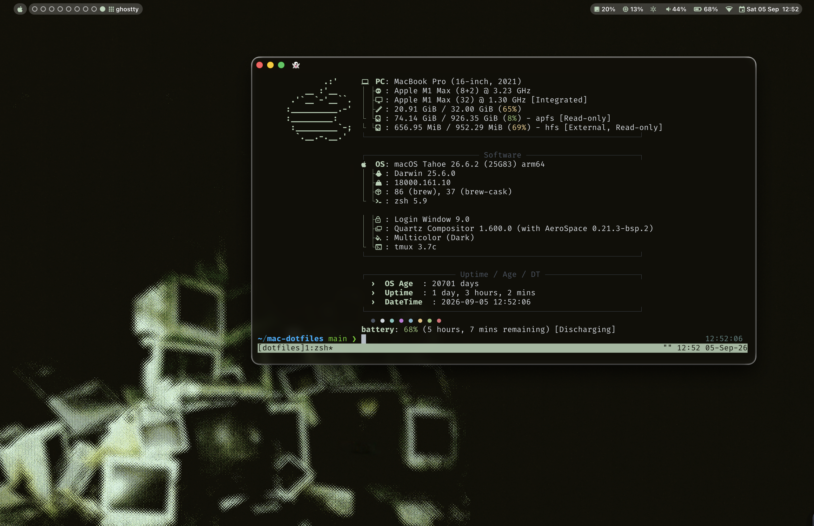

# mac-dotfiles
Dotfiles for my **Mac** machines



## Repo setup

This repo has a few main folders.

1. **/macos** which houses all the scripts to set my system settings right.
2. The configs files presentes by each programs name followed by their path. Using Stow all the configs are put in their right place on the new machine.

## Using the dotfiles repo

Download the repo into the home directory, cd into it and run the `setup.sh`.
```bash
cd mac-dotfiles
./setup.sh
```

Make a SSH key, copy the content to clipboard and add it to [github](github.com) or [gitlab](gitlab.com)
```
ssh-keygen
cat ~/.ssh/id_ed25519.pub | pbcopy
```

At last make the ssh key reachable by the machine by encrypting it and adding it to the keychain
```
chmod 700 ~/.ssh
chmod 600 ~/.ssh/config
ssh-add --apple-use-keychain ~/.ssh/id_ed25519
ssh -T git@github.com
```

To connect the downloaded folder to the right repo you have to make sure the folder is located in the home `~/` directory. Then connect to the repo using ssh:
```
cd ~/mac-dotfiles

git init
git remote add origin git@github.com:mviersel/mac-dotfiles.git
git fetch origin
```

## Brower plugins an scripts

<details>
  <summary>Firefox extensions and tweaks</summary>

- [hide youtube shorts](https://addons.mozilla.org/en-US/firefox/addon/hide-youtube-shorts/)
- [zen internet](https://addons.mozilla.org/nl/firefox/addon/zen-internet/)
- [bitwarden](https://addons.mozilla.org/en-US/firefox/addon/bitwarden-password-manager/)
- [sponsor block](https://addons.mozilla.org/en-US/firefox/addon/sponsorblock/)
- [ublock origin](https://addons.mozilla.org/en-US/firefox/addon/ublock-origin/)
- [vimium](https://addons.mozilla.org/en-US/firefox/addon/vimium-ff/)
- [darkreader](https://addons.mozilla.org/nl/firefox/addon/darkreader/)
- [youtube windowed fullscreen](https://addons.mozilla.org/en-US/firefox/addon/youtube-window-fullscreen/)
- [Raindrop](https://addons.mozilla.org/en-US/firefox/addon/raindropio/)
- [Tampermonkey](https://addons.mozilla.org/en-US/firefox/addon/tampermonkey/)
  - Zen mods
- [transparent zen](https://zen-browser.app/mods/642854b5-88b4-4c40-b256-e035532109df/?q=trans)
- [Ghost tabs](https://zen-browser.app/mods/c01d3e22-1cee-45c1-a25e-53c0f180eea8/?page=3)

</details>

<details>
  <summary>Chrome extensions and tweaks</summary>

- [hide youtube shorts](https://chromewebstore.google.com/detail/hide-shorts-for-youtube/ankepacjgoajhjpenegknbefpmfffdic)
- [bitwarden](https://chromewebstore.google.com/detail/bitwarden-password-manage/nngceckbapebfimnlniiiahkandclblb)
- [sponsor block](https://chromewebstore.google.com/detail/sponsorblock-for-youtube/mnjggcdmjocbbbhaepdhchncahnbgone)
- [ublock origin](https://chromewebstore.google.com/detail/ublock/epcnnfbjfcgphgdmggkamkmgojdagdnn)
- [vimium](https://chromewebstore.google.com/detail/vimium/dbepggeogbaibhgnhhndojpepiihcmeb)
- [darkreader](https://chromewebstore.google.com/detail/dark-reader/eimadpbcbfnmbkopoojfekhnkhdbieeh)
- [youtube windowed fullscreen](https://chromewebstore.google.com/detail/youtube-windowed-fullscre/gkkmiofalnjagdcjheckamobghglpdpm)
- [Raindrop](https://chromewebstore.google.com/detail/raindropio/ldgfbffkinooeloadekpmfoklnobpien)
- [Tampermonkey](https://chromewebstore.google.com/detail/tampermonkey/dhdgffkkebhmkfjojejmpbldmpobfkfo?hl=en)
- [zen internet](https://chromewebstore.google.com/detail/zen-internet/dpkamhkboipomecencjpammmjdfkgjha?pli=1)
- [ghostery](https://chromewebstore.google.com/detail/ghostery-adblocker-for-pr/mlomiejdfkolichcflejclcbmpeaniij)

</details>

<details>
  <summary>Scripts recommended</summary>

  - scripts
- [bypass pahe](https://greasyfork.org/id/scripts/443277-bypass-pahe-links)
- [bypass shortlinks](https://codeberg.org/Amm0ni4/bypass-all-shortlinks-debloated)

</details>
